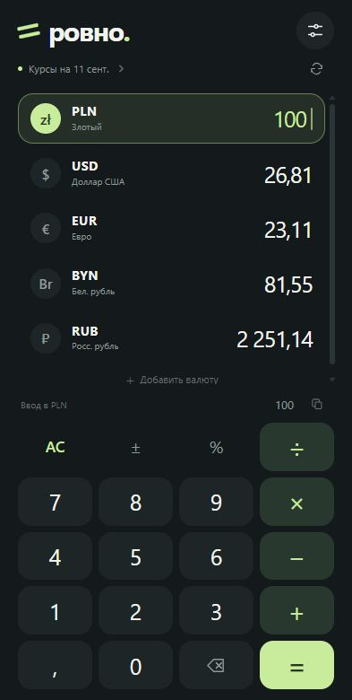
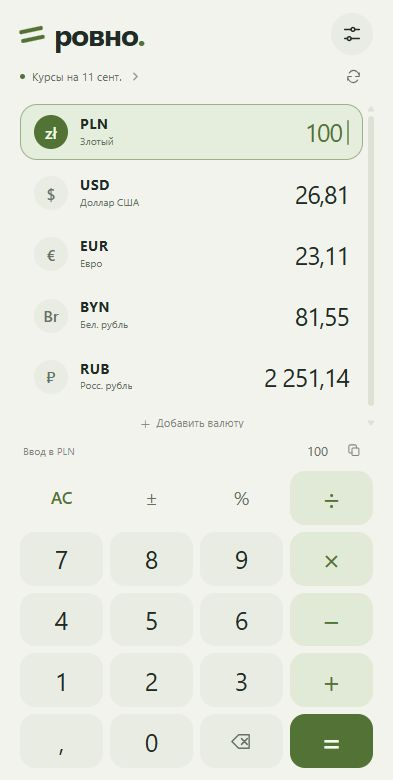

# Ровно

Личный конвертер валют с калькулятором для Android. Без рекламы, подписок, регистрации и аналитики.

**Статус: первая версия 0.1.0 реализована, установочный APK ещё не опубликован.** Локально проходят 15 тестов калькулятора и 7 тестов данных курсов; release-сборка и Android Lint завершились успешно. Проверка на Android-устройстве и подпись релиза ещё предстоят.

**[Что сделано и что осталось → STATUS.md](STATUS.md)** · [Сборки GitHub Actions](https://github.com/Gr0mi4/rovno/actions) · [Предложить изменение](https://github.com/Gr0mi4/rovno/issues)

 

Превью интерфейса в браузере при размере 393 × 780; это ещё не скриншоты установленного Android-приложения.

## На одном экране

- PLN → USD → EUR → BYN → RUB. Все результаты одновременно, привычный порядок не прыгает.
- Коснитесь строки валюты, чтобы считать в ней. При переключении сохраняется эквивалент суммы; следующая цифра начинает новый ввод.
- Сложение, вычитание, умножение, деление, смена знака и проценты. Например, `200 − 15 % = 170`.
- Другие валюты добавляются через поиск. Основной список можно настроить.
- Тёмная, светлая и системная тема. Последний ввод и выбор валют сохраняются на телефоне.
- Копирование суммы и сохранённые курсы для работы без интернета.

## Курсы

Используется [Currency API](https://github.com/fawazahmed0/exchange-api), бесплатный источник под CC0. Таблица обновляется **ежедневно**, а не каждую секунду. Приложение проверяет обновление при открытии, если прошло шесть часов, периодически в фоне (с учётом ограничений Android), и по кнопке обновления.

На экране отображается **дата таблицы курсов**, отдельно от времени её загрузки. При ошибке соединения сохраняется последний успешный снимок. Приложение не подставляет выдуманные стартовые значения: для первого получения курсов нужен интернет.

Основной сервер — jsDelivr, резервный — Cloudflare Pages того же проекта. Все валюты пересчитываются через одну таблицу с базой USD: `сумма / курс_исходной × курс_целевой`. Промежуточные результаты не округляются до копеек. Показываемый курс справочный; обменник или банк может применять другой курс и комиссию.

## Приватность

Введённые суммы и выражения остаются на устройстве. Серверам курсов отправляется только стандартный запрос общей таблицы USD. Они видят обычные данные сетевого запроса, включая IP-адрес. Нет рекламных SDK, трекеров, регистрации, контактов, геолокации и платёжных функций.

Android-оболочка загружает только встроенные HTML/CSS/JS из APK. Внешние страницы не получают доступ к интерфейсу Android; ссылка на источник открывается в отдельном браузере. Интернет-запросы в Android выполняет ограниченный клиент на фиксированные HTTPS-адреса.

## Установка после публикации релиза

Сейчас готова только неподписанная release-сборка для проверки. Ссылки на устанавливаемый APK пока нет. После подписи и публикации:

1. Откройте [последний релиз](https://github.com/Gr0mi4/rovno/releases/latest) на телефоне и скачайте файл `.apk` из Assets.
2. Откройте скачанный файл. Если Android спросит, разрешите установку приложений из выбранного браузера/файлового приложения.
3. Установите «Ровно». Для первой загрузки курсов подключитесь к интернету.

Будущие версии с тем же идентификатором и ключом подписи устанавливаются поверх предыдущей. Перед обновлением удалять приложение не нужно.

## Разработка

Android 8.0+ (API 26), compile/target SDK 35, Java 17, Gradle 8.11.1, Android Gradle Plugin 8.9.2. Нативная оболочка использует системные Android API и WebView; у интерфейса нет внешних зависимостей.

```sh
node --test tests/*.test.js
./gradlew testDebugUnitTest lintDebug assembleRelease
```

Для Android SDK задайте `ANDROID_HOME` или локальный `local.properties` с `sdk.dir`. Неподписанная release-сборка сама по себе не устанавливается на телефон.

Для подписанной сборки предусмотрены переменные `ROVNO_KEYSTORE`, `ROVNO_STORE_PASSWORD`, `ROVNO_KEY_ALIAS`, `ROVNO_KEY_PASSWORD`. Ключи и пароли нельзя коммитить в репозиторий. Для CI используется `ROVNO_KEYSTORE_BASE64` и соответствующие зашифрованные секреты GitHub — только после отдельного согласования их хранения владельцем.

## Почему такой интерфейс

При подготовке первой версии изучены опубликованные функции и страницы Google Play: [Currency Converter Plus](https://play.google.com/store/apps/details?id=com.digitalchemy.currencyconverter), [Easy Currency Converter](https://play.google.com/store/apps/details?id=com.easy.currency.extra.androary), [ALL Currency Converter](https://play.google.com/store/apps/details?id=com.smartwho.SmartAllCurrencyConverter) и [Xe](https://play.google.com/store/apps/details?id=com.xe.currency). Общие удачные решения — несколько валют сразу, калькулятор рядом с результатами, короткое избранное и офлайн-кэш. В «Ровно» они собраны в собственном интерфейсе без рекламы и экранов денежных переводов. Это анализ описаний и отзывов, а не тестирование установленных приложений конкурентов.
